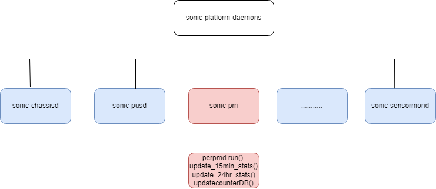

# Platform Monitor PM High Level Design 

### Rev 0.1 

### Revision 

 | Rev |     Date    |       Author       | Change Description                |
 |:---:|:-----------:|:------------------:|-----------------------------------|
 | 0.1 |             |     accelink      | Initial version                   |

### Scope  

This document describes the high level design of PMON in SONiC

### Overview：

15-minute and 24-hour performance data monitoring and alarm monitoring for sonic-otn products。

### 1 Main functions：

*   Periodically obtain real-time data of peripherals, count and calculate the maximum, minimum, average and real-time values of 15 minutes or 24 hours of data, and save performance statistics to the counter database and history database.
    
*   According to the real-time value and threshold value in the state database, according to the general processing alarm processing and alarm disappearance processing.。
    

### 2 Architecture Design

### 2.1 Framework Diagram：

### 2.2 Performance Module Program Processing： 

### 2.3 Component Description：

PM component：

It is mainly used to read the real-time values of the attributes of the status database of PSU,FAN,CHASSIS,LINECARD and other related components periodically, and is used to calculate the maximum, minimum, and average data of 15 minutes and 24 hours, and save to the performance database

ALARM component：

\- an alarm will be raised when a PSU's power is rising accross the critical threshold

\- an alarm will be cleared when a PSU's power is dropping across the warning-suppress threshold

### 2.4 API Design：

*   PM Instance creation API：
    

This interface belongs to PM object. When the sub-objects derived from PM are initialized, the creation is triggered according to the needs of actual data. The object is stored in the\_cache member variable of PM

*   State database query API：
    

According to the table-name,name,id,pm-type of the object, it is associated with the key in the state db, and the corresponding value value is queried through the key.

*   PM statistics API：
    

According to the value of the query state db, the maximum value, minimum value and average value of PM are counted.

*   Save PM data API：
    

Store counter or history database in PM data format.

### 2.5 DB schema for PM：

*   PM information is stored in counter table:
    

 ; Defines information for a PM

    key         = TABLE|component\_name|PM\_name|15MinOr24Hour|history Or current|start\_time ; information for the PM

    starttime    = STRING          

    Instant      = STRING          

    Avg         = STRING          

    min         = STRING

    max         = STRING

    interval      = STRING

    min-time     = STRING 

    max-time    = STRING 

    Validity      = STRING

**E****xample****：**

### 2.6 PM command:

\[ccc\] show psu 1 pm 15 history 1

  SHOW PSU-5 HISTORY

       StartTime                               :  2024-06-06 18:30:00

       EndTime                                 :  2024-06-06 18:45:00

Name            Starttime            Instant    Avg     Min      Max      Min-time             Max-time             Valid

\--------------  -------------------  ---------  ------  -------  -------  -------------------  -------------------  --------

temperature     2024-06-06 18:30:00  28.18 C    28.3 C  28.06 C  28.71 C  2024-06-06 18:32:33  2024-06-06 18:38:14  complete

input\_current   2024-06-06 18:30:00  0.0 A      0.00 A  0.0 A    0.0 A    2024-06-06 18:30:06  2024-06-06 18:30:06  complete

output\_current  2024-06-06 18:30:00  0.0 V      0.00 V  0.0 V    0.0 V    2024-06-06 18:30:06  2024-06-06 18:30:06  complete

input\_voltage   2024-06-06 18:30:00  0.0 A      0.00 A  0.0 A    0.0 A    2024-06-06 18:30:06  2024-06-06 18:30:06  complete

output\_voltage  2024-06-06 18:30:00  0.0 V      0.00 V  0.0 V    0.0 V    2024-06-06 18:30:06  2024-06-06 18:30:06  complete

output\_power    2024-06-06 18:30:00  0.0 W      0.00 W  0.0 W    0.0 W    2024-06-06 18:30:06  2024-06-06 18:30:06  complete

\[ccc\] show psu 1 pm 15 current 

  SHOW PSU-5 Current

       StartTime                               :  2024-06-06 18:45:00

       EndTime                                 :  2024-06-06 18:55:22

Name            Starttime            Instant    Avg     Min      Max      Min-time             Max-time             Valid

\--------------  -------------------  ---------  ------  -------  -------  -------------------  -------------------  ----------

temperature     2024-06-06 18:45:00  28.18 C    28.3 C  28.06 C  28.56 C  2024-06-06 18:54:41  2024-06-06 18:48:24  incomplete

input\_current   2024-06-06 18:45:00  0.0 A      0.00 A  0.0 A    0.0 A    2024-06-06 18:45:04  2024-06-06 18:45:04  incomplete

output\_current  2024-06-06 18:45:00  0.0 V      0.00 V  0.0 V    0.0 V    2024-06-06 18:45:04  2024-06-06 18:45:04  incomplete

input\_voltage   2024-06-06 18:45:00  0.0 A      0.00 A  0.0 A    0.0 A    2024-06-06 18:45:04  2024-06-06 18:45:04  incomplete

output\_voltage  2024-06-06 18:45:00  0.0 V      0.00 V  0.0 V    0.0 V    2024-06-06 18:45:04  2024-06-06 18:45:04  incomplete

output\_power    2024-06-06 18:45:00  0.0 W      0.00 W  0.0 W    0.0 W    2024-06-06 18:45:04  2024-06-06 18:45:04  incomplete

### 2.7 DB schema for ALARM：

*   Alarm information is stored in counter table:
    

 ; Defines information for a alarm

    key            \= CURALARM|component\_name|alarm\_id  ; information for the alarm

    id             \= STRING          

    time-created    \= STRING          

    resource       \= STRING          

    text           \= STRING

    type-id        \= STRING

severity        \= STRING

service-affect   = STRING 

max-time     \= STRING 

Validity       \= STRING

 **E****xample****：**

127.0.0.1:6379\[6\]> HGETall CURALARM|CHASSIS-1#VERSION\_MISMATCH

 1) "id"

 2) "CHASSIS-1#VERSION\_MISMATCH"

 3) "time-created"

 4) "1717656723816795648"

 5) "resource"

 6) "CHASSIS-1"

 7) "text"

 8) "Chassis version mismatch"

 9) "type-id"

10) "VERSION\_MISMATCH"

11) "severity"

12) "MAJOR"

13) "service-affect"

14) "false"

### 2.8 Alarm Command：

### 3 Tests
| Test Case | Description |
| --------- | ----------- |
| 1         | create a new FAN/PSU PM entity object. |
| 2         | Delete FAN/PSU PM entity object. |
| 3         | read/write value to state DB by key. |
| 4         | according to the states DB value of the PM entity object, a record will be generated and written into the counter or history DB every 15 minutes and every 24 hours.|
| 5         | History DB PM data records are automatically removed once they exceed the predefined expiration period, (expiration period can be customized , Example:7 days).|
| 6         | The alarms threshold values for add/delete/modify/read from the DB.|
| 7         | value exceeds the alarm threshold, a alarm record is generated, stored in the current alarm DB,Record an alarm create entry into the history alarm databaseDB .|
| 8         | value Below the alarm threshold，Clear the alarm record data stored in the current alarm DB，Record an alarm clear entry into the history alarm databaseDB.|
